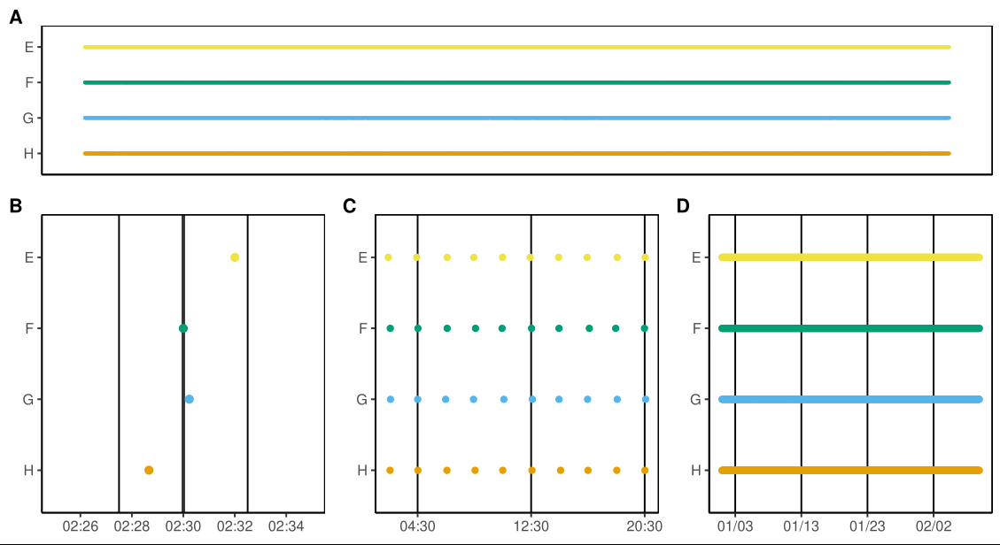
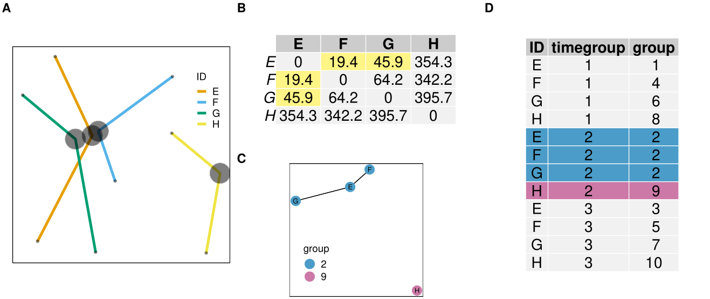
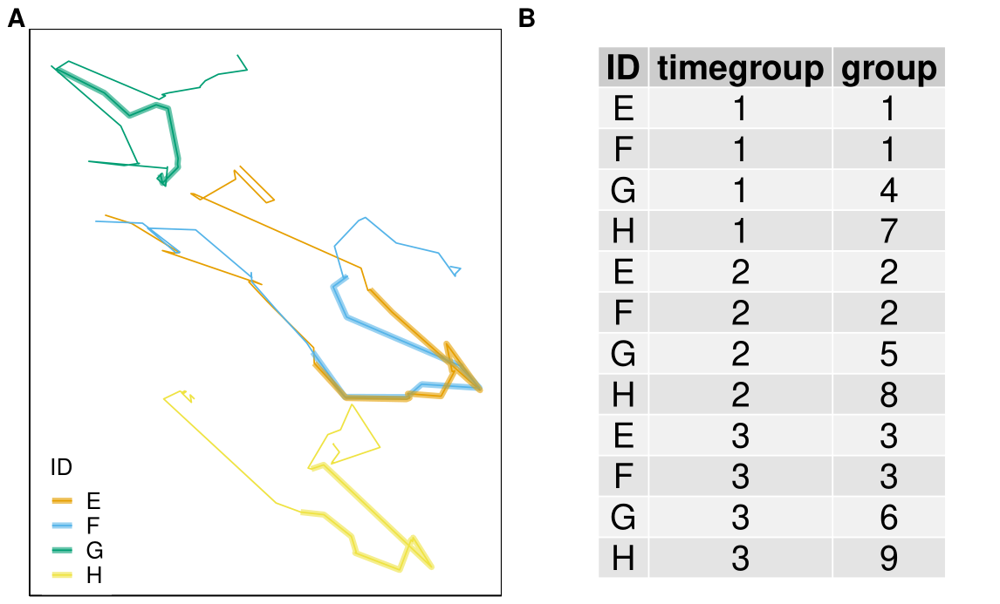
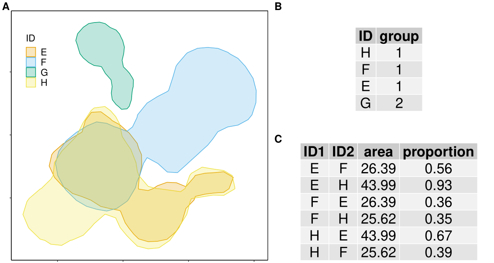
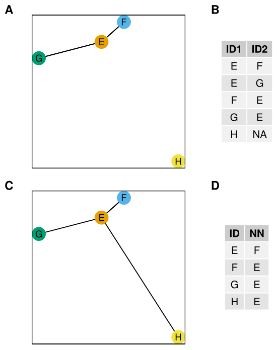

```{r opts, include = FALSE}
knitr::opts_chunk$set(message = FALSE, 
                      warning = FALSE,
                      eval = FALSE, 
                      echo = TRUE)
```

# spatsoc 

<!-- badges: start -->
[](https://www.repostatus.org/)
[](https://github.com/ropensci/software-review/issues/237)
[](https://cran.r-project.org/package=spatsoc)
[](https://cran.r-project.org/web/checks/check_results_spatsoc.html)
[](https://github.com/ropensci/spatsoc/actions/workflows/R-CMD-check.yaml)
[](https://app.codecov.io/gh/ropensci/spatsoc)
<!-- badges: end -->


### [News](#news) - [Installation](#installation) - [Usage](#usage) - [Contributing](#contributing)

`spatsoc` is an R package for detecting spatial and temporal groups in GPS relocations. It can be used to convert GPS relocations to gambit-of-the-group format to build proximity-based social networks with grouping and edge-list generating functions. In addition, the `randomizations` function provides data-stream randomization methods suitable for GPS data and the `get_gbi` function generates group by individual matrices useful for building networks with `asnipe::get_network`. 

See below for [installation](#installation) and basic [usage](#usage). 

For more details, see the [blog post](https://ropensci.org/blog/2018/12/04/spatsoc/) and vignettes:

* [Introduction to spatsoc](https://docs.ropensci.org/spatsoc/articles/intro.html)
* [Frequently asked questions](https://docs.ropensci.org/spatsoc/articles/faq.html)
* [Using spatsoc in social network analysis](https://docs.ropensci.org/spatsoc/articles/using-in-sna.html)
* [Using edge list and dyad id functions](https://docs.ropensci.org/spatsoc/articles/using-edge-and-dyad.html)


## News
### R-spatial evolution

`spatsoc` has been updated according to the [R-spatial evolution](https://r-spatial.org/r/2022/04/12/evolution.html), to remove
deprecated package dependencies in favour of modern spatial R packages. In 
our case, this means replacing `rgeos`, `rgdal` and `sp` with `sf`. 

Below is a list of user-side differences for `spatsoc` users: 

- spatsoc now depends on `sf`, `units` instead of `rgeos` and `sp`
- `build_lines` now returns an `sf` LINESTRING object
- `build_polys` now returns an `sf` POLYGON/MULTIPOLYGON object
- `group_lines` now accepts an input `sf` LINESTRING object (argument "sfLines") 
and internally uses `sf::st_intersects`, `sf::st_buffer`, etc instead of `rgeos` functions
- `group_polys` now accepts an input `sf` POLYGON/MULTIPOLYGON object (argument "sfPolys") 
and internally uses `sf::st_intersects`, `sf::st_area`, etc instead of `rgeos` functions. 
`group_polys` now returns area and proportion of overlap (%) when `area = TRUE` with 
respective units using the `units` package

The details of these changes are available in [PR 50](https://github.com/ropensci/spatsoc/issues/50). 

If required, the old version using retired spatial packages can be installed 
with the following but please note that in October 2023 `rgeos`, `rgdal` and 
`maptools` will no longer be available on CRAN. 

```{r old_install}
remotes::install_github('ropensci/spatsoc@v0.1.17')
```


---

We wrote a [`targets`](https://github.com/ropensci/targets) workflow, available
at
[github.com/robitalec/targets-spatsoc-networks](https://github.com/robitalec/targets-spatsoc-networks).
`targets` is an incredible package for designing workflows in R and, with it, we
can reproducibly run all steps from raw telemetry data to output networks and
metrics. Check it out and let us know how it works for you!


Edge-list generating functions added:

  * `edge_nn`
  * `edge_dist`
  
and dyad id function:

  * `dyad_id`
  
(feedback welcome as always!)

Both documented further in a vignette: [Using edge list and dyad id functions](https://docs.ropensci.org/spatsoc/articles/using-edge-and-dyad.html).


Also, our article describing `spatsoc` is published at Methods in Ecology and Evolution. [Link here](https://doi.org/10.1111/2041-210X.13215). Thanks to reviewers and editors at [rOpenSci](https://github.com/ropensci/software-review/issues/237) and at [MEE](https://besjournals.onlinelibrary.wiley.com/journal/2041210x). 


More detailed news [here](https://docs.ropensci.org/spatsoc/news/index.html).


## Installation

```{r install}
# Stable release
install.packages('spatsoc')

# Development version (choose one option)
install.packages('spatsoc', 
                 repos = c('https://robitalec.r-universe.dev',
                           'https://cloud.r-project.org'))
remotes::install_github('ropensci/spatsoc')
```

`spatsoc` depends on `sf`, see [here](https://github.com/r-spatial/sf#installing)
for help installing. 


## Usage
### Load package, import data
`spatsoc` expects a `data.table` for all of its functions. If you have a `data.frame`, you can use `data.table::setDT()` to convert it by reference. If your data is a text file (e.g.: CSV), you can use `data.table::fread()` to import it as a `data.table`. 

```{r library}
library(spatsoc)
library(data.table)
DT <- fread(system.file("extdata", "DT.csv", package = "spatsoc"))
DT[, datetime := as.POSIXct(datetime, tz = 'UTC')]
```


### Temporal grouping
`group_times` groups rows temporally using a threshold defined in units of minutes (B), hours (C) or days (D). 



### Spatial grouping 
`group_pts` groups points spatially using a distance matrix (B) and a spatial threshold defined by the user (50m in this case). Combined with `group_times`, the returned 'group' column represents spatiotemporal, point based groups (D). 




`group_lines` groups sequences of points (forming a line) spatially by buffering each line (A) by the user defined spatial threshold. Combined with `group_times`, the returned 'group' column represents spatiotemporal, line overlap based groups (B). 




`group_polys` groups home ranges by spatial and proportional overlap. Combined with `group_times`, the returned 'group' column represents spatiotemporal, polygon overlap based groups. 





### Edge-list generating functions
`edge_dist` and `edge_nn` generate edge-lists. `edge_dist` measures the spatial distance between individuals (A) and returns all pairs within the user specified distance threshold (B). `edge_nn` measures the distance between individuals (C) and returns the nearest neighbour to each individual (D). 



### Social network analysis functions
`randomizations` for data-stream randomization and `get_gbi` for generating group by individual matrices. 


# Contributing
Please note that this project is released with a [Contributor Code of Conduct](CODE_OF_CONDUCT.md). By participating in this project you agree to abide by its terms.
  
Development of `spatsoc` welcomes contribution of feature requests, bug reports and suggested improvements through the [issue board](https://github.com/ropensci/spatsoc/issues). 

See details in [CONTRIBUTING.md](CONTRIBUTING.md). 

[](https://ropensci.org)
