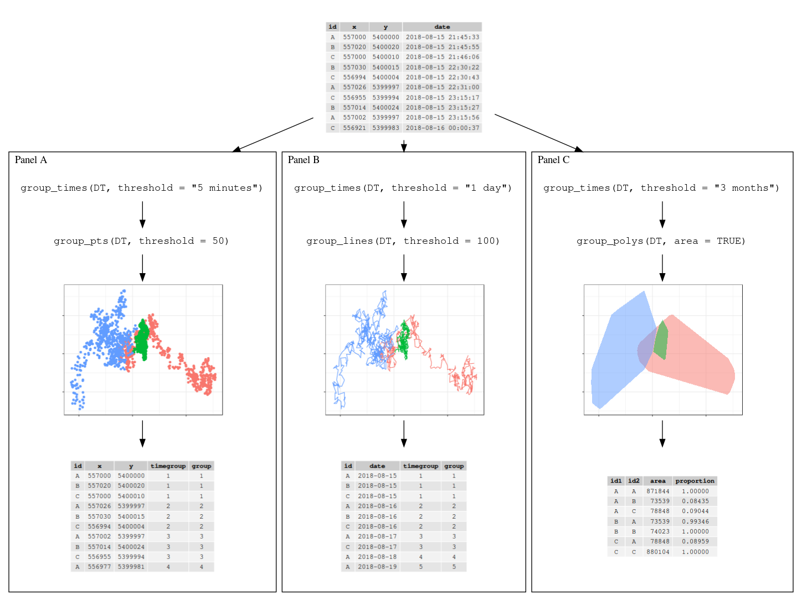

# spatsoc

The spatsoc package detects spatial and temporal groups in GPS
relocations. It can be used to convert GPS relocations to
gambit-of-the-group format to build proximity-based social networks. In
addition, the randomizations function provides data-stream randomization
methods suitable for GPS data.

## Installation

``` r
drat::addRepo('LocalRepo', 'https://spatsoc.gitlab.io')
install.packages('spatsoc')
```

## Examples

``` r
library(spatsoc)
library(data.table)
DT <- fread(system.file("extdata", "DT.csv", package = "spatsoc"))
DT[, datetime := as.POSIXct(datetime, tz = 'UTC')]
```

### Temporal grouping

#### `group_times`

``` r
group_times(DT, datetime = 'datetime', threshold = '5 minutes')
```

### Spatial grouping

<!-- -->

#### `group_pts`

``` r
group_pts(DT, threshold = 5, id = 'ID', coords = c('X', 'Y'), timegroup = 'timegroup')
```

### `group_lines`

``` r
utm <- '+proj=utm +zone=36 +south +ellps=WGS84 +datum=WGS84 +units=m +no_defs'

group_times(DT, datetime = 'datetime', threshold = '1 day')
group_lines(DT, threshold = 50, projection = utm,
            id = 'ID', coords = c('X', 'Y'),
            timegroup = 'timegroup')
```

### `group_polys`

``` r
utm <- '+proj=utm +zone=36 +south +ellps=WGS84 +datum=WGS84 +units=m +no_defs'

group_polys(DT, area = FALSE, 'mcp', list(percent = 95),
            projection = utm,
            id = 'ID', coords = c('X', 'Y'))

areaDT <- group_polys(DT, area = TRUE, 'mcp', list(percent = 95),
                      projection = utm,
                      id = 'ID', coords = c('X', 'Y'))
```
