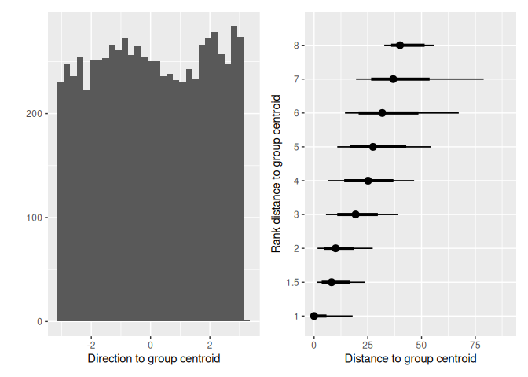
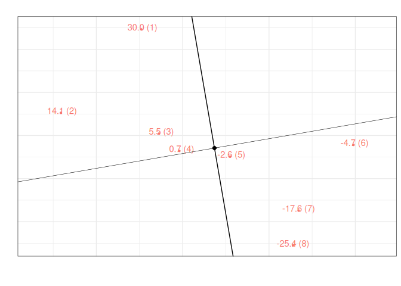
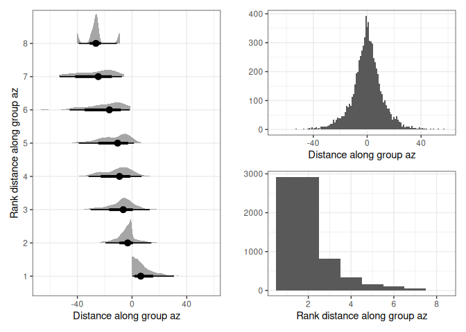
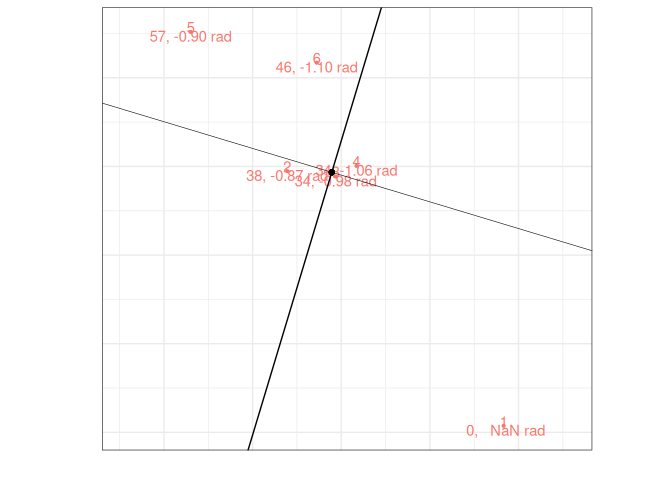
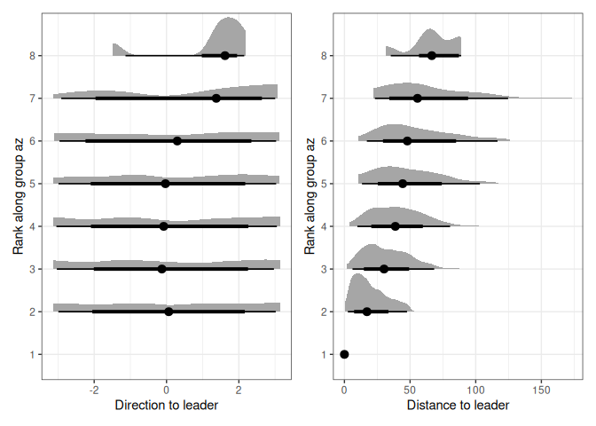
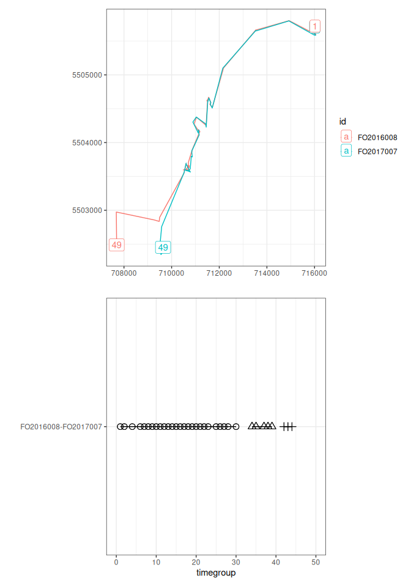
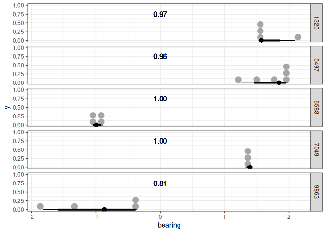
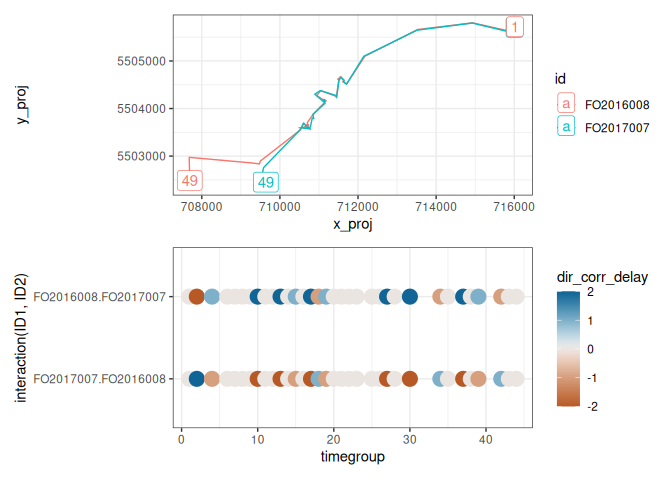

Intragroup dynamics
================
Alec Robitaille, Quinn Webber and Eric Vander Wal
2024-07-19

# Measuring intragroup dynamics

Functionality previously available in {spatsoc} includes spatiotemporal
grouping, edge list generation and data-stream permutations (Robitaille
et al. 2019). These functions have allowed users to detect interactions
between individuals, measure coocurrence within and across species, and
generate social networks from telemetry data. (TODO: cite examples
citing spatsoc)

Spatiotemporal grouping can be performed given a telemetry dataset,
temporal and spatial thresholds, and one of three grouping functions:
`group_pts`, `group_lines` or `group_polys`. Each return a unique
identifier for each spatiotemporal group, defined using point based
distances, linear trajectory overlap or home range overlap,
respectively.

For example, the suggested `group_pts` workflow with example data from
the package:

``` r
# Load packages
library(data.table)
library(spatsoc)
library(ggplot2)
library(ggdist)
library(patchwork)
library(scico)

# Read example data
DT <- fread(system.file("extdata", "DT.csv", package = "spatsoc"))

# Cast the character column to POSIXct
DT[, datetime := as.POSIXct(datetime, tz = 'UTC')]

# Set variables
temporal_threshold  <- '20 minutes'
spatial_threshold <- 50
id <- 'ID'
coords <- c('X', 'Y')

# Temporal grouping
group_times(DT, datetime = 'datetime', threshold = temporal_threshold)

# Spatial grouping with timegroup
group_pts(DT, threshold = spatial_threshold, id = id,
          coords = coords, timegroup = 'timegroup')
```

| ID  | X        | Y       | datetime            | population | minutes | timegroup | group |
|-----|----------|---------|---------------------|------------|---------|-----------|-------|
| A   | 715851.4 | 5505340 | 2016-11-01 00:00:54 | 1          | 0       | 1         | 1     |
| B   | 699640.2 | 5509638 | 2016-11-01 00:01:02 | 1          | 0       | 1         | 2     |
| C   | 710205.4 | 5505888 | 2016-11-01 00:00:44 | 1          | 0       | 1         | 3     |
| D   | 700875.0 | 5490954 | 2016-11-01 00:00:47 | 1          | 0       | 1         | 4     |
| E   | 701671.9 | 5504286 | 2016-11-01 00:00:48 | 1          | 0       | 1         | 5     |

Users can also measure dyadic interindividual distance using the
`edge_dist` function and identify nearest neighbors using the `edge_nn`
function. For example:

``` r
interindividual_dist <- edge_dist(
  DT,
  threshold = spatial_threshold,
  id = id,
  coords = coords,
  timegroup = 'timegroup',
  returnDist = TRUE,
  fillNA = TRUE
)
```

<table style="width:49%;">
<colgroup>
<col style="width: 16%" />
<col style="width: 8%" />
<col style="width: 8%" />
<col style="width: 15%" />
</colgroup>
<thead>
<tr class="header">
<th>timegroup</th>
<th>ID1</th>
<th>ID2</th>
<th>distance</th>
</tr>
</thead>
<tbody>
<tr class="odd">
<td>1</td>
<td>A</td>
<td>NA</td>
<td><pre><code>  NA</code></pre></td>
</tr>
<tr class="even">
<td>1</td>
<td>B</td>
<td>G</td>
<td>5.782904</td>
</tr>
<tr class="odd">
<td>1</td>
<td>C</td>
<td>NA</td>
<td><pre><code>  NA</code></pre></td>
</tr>
<tr class="even">
<td>1</td>
<td>D</td>
<td>NA</td>
<td><pre><code>  NA</code></pre></td>
</tr>
<tr class="odd">
<td>1</td>
<td>E</td>
<td>NA</td>
<td><pre><code>  NA</code></pre></td>
</tr>
</tbody>
</table>

``` r
nearest_neighbours <- edge_nn(
  DT,
  id = id,
  coords = coords,
  timegroup = 'timegroup',
  returnDist = TRUE
)
```

<table style="width:51%;">
<colgroup>
<col style="width: 16%" />
<col style="width: 6%" />
<col style="width: 6%" />
<col style="width: 20%" />
</colgroup>
<thead>
<tr class="header">
<th>timegroup</th>
<th>ID</th>
<th>NN</th>
<th>distance</th>
</tr>
</thead>
<tbody>
<tr class="odd">
<td>1</td>
<td>A</td>
<td>I</td>
<td>4921.397041</td>
</tr>
<tr class="even">
<td>1</td>
<td>B</td>
<td>G</td>
<td><pre><code>5.782904</code></pre></td>
</tr>
<tr class="odd">
<td>1</td>
<td>C</td>
<td>I</td>
<td>972.464226</td>
</tr>
<tr class="even">
<td>1</td>
<td>D</td>
<td>J</td>
<td>11581.941376</td>
</tr>
<tr class="odd">
<td>1</td>
<td>E</td>
<td>H</td>
<td>65.061671</td>
</tr>
</tbody>
</table>

Building on these functions, {spatsoc}’s new functionality provides a
finer understanding of an individual’s behaviour with respect to
conspecifics. We aim to provide users with accessible, flexible
functions that will help them identify leader follower patterns, fission
fusion dynamics and potentially dominance behaviours in their own animal
telemetry data.

## Position within groups

Extending {spatsoc}’s abilities to identify spatiotemporal groups, a new
set of functions are now available to measure individuals position
relative within spatiotemporal groups.

After identifying spatiotemporal groups with eg. `group_pts`, we can
measure the group centroid. The group centroid is defined as the the
mean of individual locations in a group.

``` r
group_centroid(DT, coords = coords)
```

    ## group column will be overwritten by this function

| ID  | X        | Y       | datetime            | timegroup | group | group_mean_X | group_mean_Y |
|-----|----------|---------|---------------------|-----------|-------|--------------|--------------|
| A   | 715851.4 | 5505340 | 2016-11-01 00:00:54 | 1         | 1     | 715851.4     | 5505340      |
| B   | 699640.2 | 5509638 | 2016-11-01 00:01:02 | 1         | 2     | 699637.9     | 5509637      |
| C   | 710205.4 | 5505888 | 2016-11-01 00:00:44 | 1         | 3     | 710205.4     | 5505888      |
| D   | 700875.0 | 5490954 | 2016-11-01 00:00:47 | 1         | 4     | 700875.0     | 5490954      |
| E   | 701671.9 | 5504286 | 2016-11-01 00:00:48 | 1         | 5     | 701671.9     | 5504286      |

Then we can measure each individual’s direction and distance to the
group centroid. The distance to group centroid is the distance between
from the focal individual to the group centroid. The direction to group
centroid is the absolute azimuth from the focal individual to the group
centroid. The rank distance to group centroid is the ordinal rank of
individuals’ distances to the group centroid.
<!-- TODO: insert refs with examples of biological interpretation of distance and direction to  -->
<!-- group centroid.  -->

``` r
distance_to_group_centroid(DT, coords, return_rank = TRUE)
bearing_to_group_centroid(DT, coords)
```

<!-- -->

After considering how individuals are positioned relative to the group
centroid, we can also measure how individuals are positioned relative to
the mean group direction. To do so, we rotate the coordinate system
around the group centroid by the mean bearing of all individuals in the
group. Then we take the distance along this new axis to the measure of
front-back position within the group.
<!-- TODO: refs where this is used, extended biological interpretation -->

The position within group is the position along the front-to-back axis
of the group’s bearing (eg. \[@Quera_2023; @Harel_2021\]). The rank
position within group is the ordinal rank along the front-to-back axis
of the group’s bearing (eg. \[@Burns_2012\]). The time spent leading
group is an aggregate metric of the time in the first rank position
within group. The distance to leader is the geographic distance from the
focal individual to the group’s leader. The direction to leader is the
absolute azimuth from the focal individual to the group’s leader.

``` r
projection <- 32636
bearing_sequential(DT, id = id, coords = coords, projection = projection)
group_bearing(DT)
position_within_group(DT, coords = coords, return_rank = TRUE)
```

    ## Linking to GEOS 3.12.2, GDAL 3.9.0, PROJ 9.4.1; sf_use_s2() is TRUE

<!-- --><!-- -->

## Position relative to leader

Taking a simple, dynamic definition of leadership, we can identify the
distance and direction of each individual to the leader of each
spatiotemporal group.

``` r
distance_to_leader(DT, coords = coords)
bearing_to_leader(DT, coords = coords)
```

<!-- --><!-- -->

## Fission fusion

Given the variability in defining fission fusion dynamics in the
literature, we developed a flexible function that allows users to both
use their system specific definitions and at the same time easily
compare to results to other definitions.

Function arguments: - `threshold`: spatial distance threshold to
establish a fusion event - `n_min_length`: the minimum number of
successive fixes that are required to establish a fusion event -
`n_max_missing`: the maximum number of allowable missed observations for
either individual in a dyad within a fusion event - `allow_split`: if
fusion events allow a temporary spatial splitting for one observation
without resulting in a fission event

<!-- See Table Sup B: varying definitions of fission fusion -->

``` r
# Fission fusion events using interinvidiual distance calculated with edge_dist
fusion_events <- fusion_id(
  interindividual_dist,
  threshold = spatial_threshold, 
  n_min_length = 0, 
  n_max_missing = 0, 
  allow_split = FALSE
)
```

<!-- -->

## Bearings

Next, we can use individuals’ bearings to explore interindividual
direction, directional alignment and group polarization.

<!-- TODO: references -->
<!-- related eg. direction between individuals (always L / R), polarization of flock, -->
<!-- etc -->

Polarization measures the uniformity of absolute azimuth in a group of
individuals \[@Wang_2022\] on a scale of 0-1 where values near 0
indicate that azimuths point in different directions and values near 1
indicate that azimuths point in similar directions.

``` r
# Calculate polarization using azimuth from az_sequential()
bearing_polarization(DT)
```

<!-- -->

Directional alignment is the relative difference between two
individuals’ azimuths. Given the similarity to `edge_dist`, this
functionality is provided under a similar name: `edge_az`.

``` r
directional_align <- edge_az(
  DT,
  threshold = NULL,
  id = id,
  timegroup = 'timegroup',
  coords = coords,
  returnDist = TRUE,
  fillNA = TRUE
)
```

Interindividual direction measures the absolute azimuth between
individuals.

(TODO)
<!-- TODO: interindividual difference in bearing code and example -->

## Lagged differences in bearing

The directional correlation delay \[@Nagy_2010\] of individuals i, j is
given by

$$C_{ij} = [\overrightarrow{v_{i}}(t) * \overrightarrow{j}(t + \tau)]_{t}$$

where

- $\overrightarrow{v_{i}}(t)$ is the normalized velocity of individual i
  at time t
- $\overrightarrow{v_{j}}(t + \tau)$ is the normalized velocity of
  individual j at time t + $\tau$
- Note that $C_{ij}(\tau)$ = $C_{ji}(-\tau)$
- Calculated only where pairs of individuals were less than 100 m apart

The maximum value of the directional correlation function $C_{ij}$ is at
$C_{ij}(\tau^{*}_{ij})$ where $\tau^{*}_{ij}$ is the directional
correlation delay time. $\tau^{*}_{ij}$ values focus on the relationship
in pairs of individuals, ignoring hierarchy changes caused by other
individuals.

- Note that $\tau^{*}_{ij}$ = $-\tau^{*}_{ji}$
- Negative values indicate that flight directional changes of individual
  i falls behind that of individual j and therefore j is leading

Hierarchical networks can be generated using $\tau^{*}_{ij}$.

``` r
# Cast the character column to POSIXct
DT[, datetime := as.POSIXct(datetime, tz = 'UTC')]

# Temporal grouping
DT <- group_times(DT, datetime = 'datetime', threshold = temporal_threshold)

# Interindividual distance with maximum distance threshold set at 50 m
interindividual_dist <- edge_dist(
  DT,
  threshold = 100,
  id = id,
  coords = coords,
  timegroup = 'timegroup',
  returnDist = TRUE,
  fillNA = TRUE
)

# Identify fusion events
fusion_events <- fusion_id(
  interindividual_dist,
  threshold = spatial_threshold, 
  n_min_length = 0, 
  n_max_missing = 0, 
  allow_split = FALSE
)

# Calculate the directional correlation delay during fusion events
dir_delay <- edge_delay(
  DT = DT,
  id = id,
  edges = fusion_events[!is.na(fusionID)],
  window = 2
)
```

<!-- -->

<!-- TODO: example of hierarchical networks -->

## Behavioural zones

The behavioural zones metric assigns neighbours to three non-overlapping
behavioural zones \[Couzin_2002\]. The “zone of repulsion” is the
minimum distance around an individual within which neighbours are
expected to move away to avoid collisions. The “zone of orientation” is
the next zone around an individual beyond the “zone of repulsion” within
which neighbours are expected to orient themselves to the movement of
their neighbours. The “zone of attraction” is the farthest zone around
an individual within which neighbours are expected to be attracted to
the position of the focal individual. Notably, there is a possibly
“blind volume” behind the individual representing the limits of their
perception.

(TODO)

<!-- TODO: code and example -->
